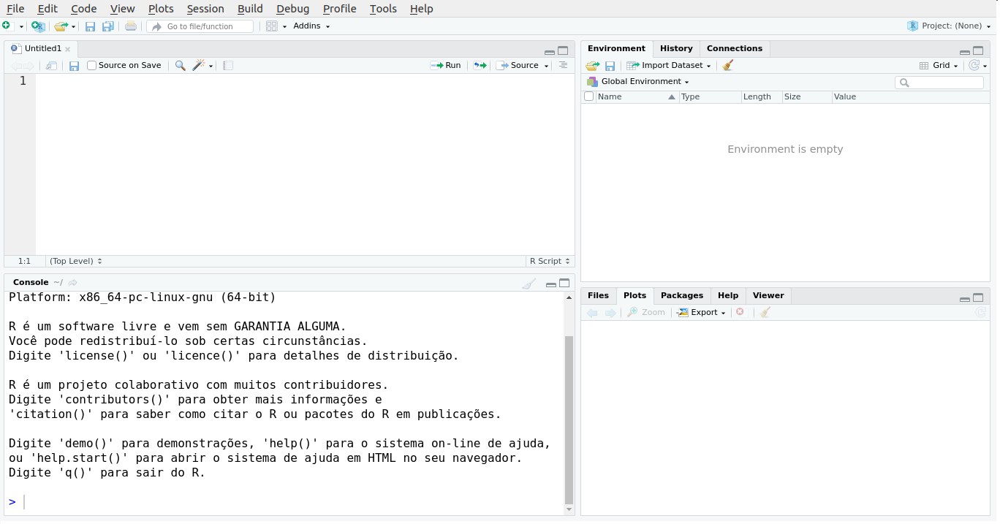
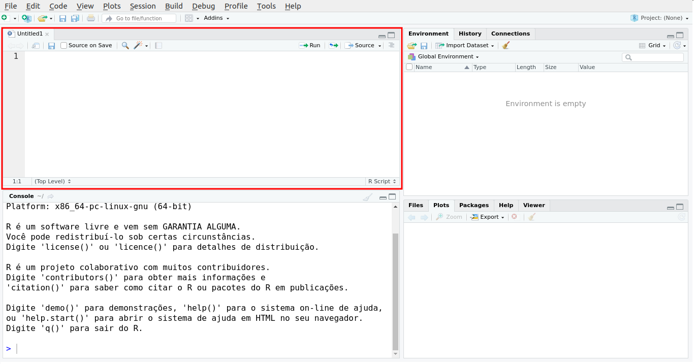
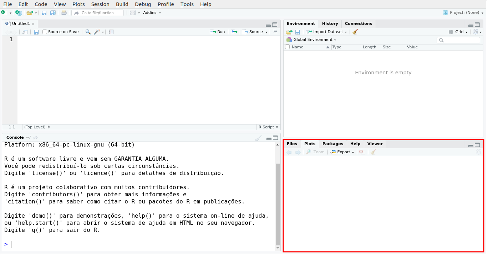

---
output:
  html_document:                    # Classe de documento.
    toc: true                       # Exibir sum?rio.
    toc_depth: 2                    # Profundidade do sum?rio.
    toc_float:                      # Sum?rio flutuante na borda.
      collapsed: true
      smooth_scroll: true
    number_sections: true           # Se??es numeradas.
    theme: cerulean
    #spacelab
    #default,cerulean,journal,flatly,readable,spacelab,
    #united,cosmo,lumen,paper,sandstone,simplex,yeti
    
    highlight: espresso
    #default, tango, pygments, kate, monochrome, espresso, zenburn, haddock, and textmate
    #css: styles.css                 # Caminho para arquivo CSS.
    fig_width: 7                    # Lagura das figuras.
    fig_height: 6                   # Altura das figuras.
    fig_caption: true               # Exibica??o de legenda.
    fig_align: 'center'
#    code_folding: hide              # Esconder/exibir bloco de c?digo.
#    keep_md: true                   # Manter o arquivo md.
    #template: quarterly_report.html # Caminho para o template.  
---

```{r setup, include=FALSE}
knitr::opts_chunk$set(echo = TRUE, cache = TRUE)
```

---

<font size="8"> 
<p align=”center”> <b> Primeiros Passos com o R </b> </center>
</font>

<font size="5"> 
<p align=”center”> <b> Parte 1 - Histórico e Primeiro contato </b> </center>
</font>

<font size="4"> 
<p align=”center”> [Lineu Alberto Cavazani de Freitas](https://lineu96.github.io/st/) </center>
</font> 

---

# O que é o R

O [R](https://www.r-project.org/) é uma linguagem de programação voltada para fins estatísticos, isto é, focada em métodos para análise de dados que desde de sua criação foi amplamente difundida no meio acadêmico por ser gratuita. Contudo, saber utilizar a linguagem e suas principais ferramentas tem se tornado uma habilidade solicitada por aqueles que buscam profissionais com capacidades analíticas por se tratar de uma importante linguagem para ciência de dados e que, por esse motivo, vem se popularizando.  

O potencial do R é alto não só graças a forma da linguagem mas também por ser gratuito, possível instalar e utilizar em diversos sistemas operacionais e por possuir bibliotecas com funções para análise de dados provenientes de áreas de estudo específicas, os chamados pacotes. Uma série de pacotes é instalada junto com o R, mas muitos outros estão disponíveis na rede de distribuição do R ([CRAN](https://cran.r-project.org/mirrors.html)). Atualmente, existem mais de 10 mil pacotes disponíveis.

O objetivo deste material é apresentar, de forma breve, as principais características e o básico para se fazer uso da linguagem

---

<center>

</center>

---

# Histórico do R

A linguagem R foi criada em 1993 por [Ross Ihaka](https://www.stat.auckland.ac.nz/~ihaka/) e [Robert Gentleman](https://www.linkedin.com/in/robert-gentleman-06845098/) no [Departamento de Estatística da Universidade de Auckland](https://www.auckland.ac.nz/en/science/about-the-faculty/department-of-statistics.html), na Nova Zelândia. 

O R foi desenvolvido a partir da Linguagem S, criada na AT&T Bell Labs por John Chambers, Rick Becker e Allan Wilks em 1976. Atualmente o R é desenvolvido pela equipe de Desenvolvimento do R (R Core Team), da qual John Chambers é um membro. O código fonte para o ambiente de software R é escrito principalmente em C, Fortran e R e está disponível gratuitamente sob a licença GNU General Public. 

---

<center>

<figcaption>Robert Gentleman & Ross Ihaka</figcaption>
</center>

---

Assista ao vídeo ["R"eflexões: um pouco de história e experiências com o R - Paulo Justiniano Ribeiro Jr](https://youtu.be/fnGvDEkjZy0).

---

Ao instalar o R é possível utilizar a interface de linha de comando nativa, contudo há também várias interfaces gráficas que auxiliam o trabalho em R, como o [RStudio](https://rstudio.com/products/rstudio/download/).

---

# Rstudio {.tabset .tabset-fade}

Ao se trabalhar com R é interessante utilizar uma interface de desenvolvimento com o objetivo de facilitar o trabalho de forma a melhorar a visualização do código, instalação de pacotes, visualização de dados, dentre outras tarefas importantes para usuários R.

O [RStudio](https://rstudio.com/products/rstudio/download/) é um programa com uma interface mais amigável para se trabalhar com R. Possui vasta documentação gratuita na internet e está disponível para os mais famosos sistemas operacionais. Existem outras interfaces para se trabalhar com R, todavia abordaremos apenas o RStudio pois ele fornece a maioria dos recursos necessários e desejáveis para uma boa interface. 

---

<center>

</center>

---

Vejamos o aspecto da interface:

---

## O Rstudio

<center>

</center>

## Editor

<center>

</center>

## Console

<center>

</center>

## Environment/ History

<center>

</center>

## Files/ Plots/ Packages/ Help

<center>

</center>

## Resumo

 - **Editor**: Onde escrevemos os códigos (executamos com CTRL+ENTER).
 - **Console**: Onde os resultados são printados.
 - **Environment**: Mostra todos os objetos criados.
 - **History**: Mostra todos os códigos executados.
 - **Files**: Mostra os arquivos no diretório atual.
 - **Plots**: Mostra os outputs de códigos que geram gráficos.
 - **Packages**: Mostra os pacotes instalados.
 - **Help**: Mostra a documentação de funções e pacotes.

Para obter todos os atalhos da interface digite pressione ALT+SHIFT+K.
 
As imgagens representam o aspecto padrão do Rstudio. Contudo a disposição dos planos, cores e fontes são customizáveis e podem ser modificadas em `Tools > Global Options`.

---

# Diretório de trabalho

Ao iniciar um trabalho com R o primeiro passo é definir o diretório de trabalho, isto é, a pasta do computador onde estão os arquivos que importaremos e para onde vão os arquivos que exportaremos. Fazemos isso através do comando `setwd()` e dentro da função especificamos o caminho até a pasta. Outra forma de realizar a mesma tarefa é através do atalho `CTRL+SHIFT+H`.

```{r, eval=FALSE}
setwd("~/Área de Trabalho/Rpost")
```

Com a função `getwd()` verificamos o diretório atual.

```{r}
getwd()
```

---

# Script

Um script é um arquivo de texto com um conjunto de instruções para que uma tarefa seja executada em determinado aplicativo. Através de `File > New file > R script` ou `CTRL+SHIFT+N` iniciamos um script R, isto é, um arquivo com extensão .R. 

Os scripts são mostrados através de abas no editor do Rstudio. Lembre-se de salvar o script no diretório de trabalho com um nome simples evitando acentos, letras maiúsculas e símbolos.

Quando digitamos comandos no editor e pressionamos `CTRL+ENTER` o código é executado e o resultado é mostrado no console. Caso digitemos o código diretamente no console, ele também será executado porém não será salvo no script. 

Uma boa prática é comentar passo a passo o script para que facilite o entendimento após certo tempo de trabalho ou mesmo o acesso de outros contribuidores. No R comentários são adicionados após o símbolo #, de forma que tudo após o símbolo não será interpretado como código.

---

# Operações matemáticas

Os operadores aritméticos servem para realizar operações matemáticas básicas. As representações das operações básicas em R são:

| Operador 	  |          Operação         	|
|:----------:	|:-------------------------:	|
|     +    	  |           Adição          	|
|     -    	  |         Subtração         	|
|     *    	  |       Multiplicação       	|
|     /    	  |          Divisão          	|
|     ^    	  |       Potência            	|
|    exp() 	  |       Exponencial         	|
|    sqrt()	  |       Raiz quadrada       	|
| factorial() |       Fatorial            	|
|    log()  	|    Logaritmo              	|
|    abs()    |     Valor absoluto          |
|   round()   |     Arredondamento          |
|  ceiling()  |  Arredondamento para cima   |
|   floor()   | Arredondamento para baixo   |


Os operadores seguem uma hierarquia, ou seja, uma ordem de precedência. Inicialmente são efetuadas as operações entre parênteses seguindo a ordem: exponenciação, multiplicação/divisão e por fim adição/subtração. 

Para utilizar os operadores no R basta digitar os valores e a operação diretamente no console (caso queira ver somente o resultado) ou no script (caso deseje salvar o código num arquivo texto .R). 

Experimente:

```{r, eval=FALSE}
# Adição
1+1

# Subtração
5-4

# Multiplicação
2*2

# Divisão
100/5

# Exponenciação
5^5

# Potência
exp(10)

# Raiz quadrada
sqrt(81)

# Fatorial
factorial(4)

# logaritmo base e
log(10)

# logaritmo base 10
log(10, base = 10)
```

---

# Objetos

Podemos armazenar resultados de interesses em variáveis, também chamadas de objetos, para que não seja necessário repetir a operação toda vez que necessitarmos de um resultado específico. 

Para atribuir valores à variáveis, utiliza-se o símbolo "<-", lê-se "recebe". Por exemplo, caso haja uma variável nomeada como x, poderíamos escrever algo como: x <- 10; a partir deste momento, na memória do computador, x vale 10 e todas as operações são válidas. Veja:

 - Armazenando o valor 10 num objeto x:

```{r}
x <- 10
```

 - Quanto vale x?

```{r}
x
```

 - Quanto vale x+1?
 
```{r}
x+1
```

Outro exemplo:

 - Uma expressão qualquer:
 
```{r}
((log(10)+ 1/34)*2)/5
```  

 - Armazenando o resultado da expressão em um objeto y:

```{r}
y <- ((log(10)+ 1/34)*2)/5
```

 - Quanto vale y?
 
```{r}
y
```

---

Os objetos que armazenam valores ficam na memória RAM, logo, são temporários. Para listar as variáveis criadas utiliza-se o comando `ls()` e para remover uma variável da memória o comando `rm(nome_da_variavel)`. 

Para remover todas as variáveis, usa-se o comando `rm(list = ls())`, este comando deve ser usado com muito cuidado, pois apaga todas as variáveis criadas sem perguntar. Veja:

 - Listando as variáveis criadas:
```{r}
ls()
```

 - Removendo a variável x:
```{r}
rm(x)
```

 - Verificando se a variável x foi mesmo removida:
```{r}
ls()
```

 - Removendo todas as variáveis na memória temporária:
```{r}
rm(list = ls())
```

 - Não há mais variáveis criadas:
```{r}
ls()
```

---

# Rdata e Rhistory

Digamos que terminamos nosso script, todas as tarefas foram realizadas. Nos resta agora salvar as alterações finais. 

Ao fazer isso **NÃO** salvamos o conteúdo das variáveis, apenas como fizemos para obtê-las, ou seja, ao reabrir o R e utilizar o comando `ls()`, não haverá nada. 

Quando são poucos dados e o processo para obtenção das variáveis não é custoso, não há mal nisso. Contudo quando o processo para obtenção leva tempo, uma alternativa é utilizar a opção disponível em `Session > Save Workspace As...`, ao fazer isso salvamos um arquivo de extensão .Rdata que contém todos os objetos criados durante uma sessão. 

Desta forma se precisamos continuar de onde paramos, basta abrir o script e o Rdata, e todas as variáveis serão carregadas no R. Quando o R é iniciado em um diretório com um arquivo .Rdata, as variáveis salvas são automaticamente carregadas.

Ao realizar este processo geramos também um arquivo de extensão .Rhistory. Se trata de um arquivo texto que contém todos os comandos que foram digitados no console, ou seja, um histórico do que foi executado. 

---

# Funções

Funções são códigos encapsulados para realização de uma tarefa. Utilizando uma função faz com que não seja necessário escrever e copiar o código todas as vezes que precisar executar aquela operação.

Imagine um caso simples:

1. Você tem 20 vetores e deseja calcular a média de cada um destes vetores.
2. Sem uma função seria necessário somar os valores de cada elemento do vetor, dividir pelo número de elementos e replicar isto 20 vezes.
3. Se tivessemos uma função em que fornecemos o vetor e o output é a média do vetor, facilitaria muito nossa vida.

Este exemplo parece simples, mas pense em casos em que temos tarefas mais
complexas que uma média em que há necessidade de replicar mais de 20 vezes; se
torna inviável não utilizar uma função.

---

Funções R têm a seguinte forma: `funcao(argumento1, argumento2, ...)`. Argumentos são os parâmetros para que a função funcione corretamente.

A lista de parâmetros, funciona como a interface de comunicação, isto é, de passagem de dados do usuário para a função. Portanto, o usuário fornece o material e a função trabalha para retornar o resultado final. 

No R existem dois tipos de argumento: aqueles em que o usuário é obrigado a informar o valor do parâmetro (senão a função não funciona) e aqueles em que tal prática é opcional (pois há um valor "default" fixado na função). Na dúvida **sempre verifique a documentação da função para evitar problemas.** 

Na documentação você encontra a finalidade da função, a função em si, todos os argumentos, a descrição de cada argumento, referências, funções relacionadas e também um exemplo prático genérico. 

Para buscar a documentação use: `?funcao` ou `help(funcao)`. Para funções que contenham o termo "palavra", basta usar `help.search("palavra")`. Experimente também os comandos `help.start()` e `RSiteSearch("palavra")`. 

---

Algumas funções R importantes são:

|        Função        |                        Tarefa                       |
|:--------------------:|:---------------------------------------------------:|
|          c()         |                    Cria um Vetor                    |
|        setwd()       |          Muda o Diretório de Trabalho Atual         |
|        getwd()       |            Mostra o Diretório de Trabalho           |
|         dir()        |   Lista os Arquivos do Diretório de Trabalho Atual  |
|     sessionInfo()    |         Mostra algumas informações da sessão        |
|  install.packages()  |                  Instala um pacote                  |
|       library()      |                  Carrega um pacote                  |
|       require()      |                  Carrega um pacote                  |
|       example()      |           Mostra exemplos de alguma função          |
|        print()       |         Imprime o resultado de uma variável         |
|          q()         |                    Fecha a Sessão                   |
|       objects()      |                Exibe objetos criados                |
|         str()        |           Mostra a estrutura de um objeto           |

---

Funções podem ser criadas pelo usuário através da função `function()`:

```{r, eval=FALSE}
nome_da_funcao <- function(argumento1, argumento2){
  corpo_da_funcao # O que fazer com os argumentos informados pelo usuário
}
```

Veja um exemplo de função para obter a média entre 2 números:

```{r}
media2n <- function(numero1, numero2){
  media <- (numero1+numero2)/2
  return(media)
}
```

Utilizando-a:

```{r}
media2n(numero1 = 5, numero2 = 0)
```

Não há necessidade de utilizar a sintaxe `argumento = valor do argumento` desde que os valores correspondentes sejam colocados em ordem correta, isso é válido para qualquer função R. Porém é altamente recomendável, principalmente a usuários iniciantes, sempre escrever o argumento e o valor.

```{r}
media2n(5, 0)
```

---

# Pacotes

Além das funções temos também os pacotes. Pacotes R são bibliotecas contendo funções e dados importantes para alguma finalidade específica. Por exemplo, o pacote `ggplot2` contém funções específicas para geração de gráficos, o pacote `gamlss` possui funções para ajuste de modelos de regressão da classe GAMLSS, dentre diversos outros.

Existem 4 tipos de pacote:
 
 - O R-base, que contém as funções principais disponíveis. Não precisa ser instalado nem carregado.
 
 - Os pacotes recomendados, que são instalados junto com o R mas que não são carregados. Como o `MASS`, `lattice`, dentre outros.
 
 - Pacotes contribuídos, também chamados de pacotes oficiais, que não vem com o R, então devem ser instalados e carregados. A lista destes pacotes está no [CRAN (Comprehensive R Archive Network)](http://cran.r-project.org/).
 
 - Pacotes não oficiais, que podem ser instalados por outros meios como arquivos comprimidos ou repositórios no github, por exemplo. Normalmente proprietários de pacotes não oficiais fornecem instruções de como proceder para instalar o pacote.

---

A instalação de pacotes oficiais pode ser feita através da função `install.packages()`. E o carregamento do pacote pode ser feito através da função `library()` ou `require()`. Quando o pacote não foi instalado o `require()` retorna FALSE. Além disso, há ainda a possibilidade de acessar uma função de um pacote instalado sem carregar todo o pacote na memória utilizando o operador `::`. Vejamos:

```{r, eval=FALSE}

install.packages("ggplot2") # instalando o pacote ggplot2

library(ggplot2) # carregando o pacote

require(ggplot2) # carregando o pacote  

ggplot2::ggplot(data = dados, mapping = aes(x=x, y=y)) 
# utilizando uma função sem carregar o pacote

```

---

# Classes

Como já mencionado, um objeto é uma variável capaz de armazenar qualquer valor ou estrutura de dados. A forma de um objeto define sua classe, e com objetos é possível formar estruturas.

No R temos as classes:

1. **numeric**: números reais.
2. **integer**: números inteiros.
3. **character**: sequência de caracteres.
4. **complex**: números complexos (imaginários).
5. **logical**: verdadeiro (TRUE) ou falso (FALSE).

Para verificar a classe de um objeto, temos a função `class`:

```{r}
# número real.
a <- 4.6
class(a)

# número inteiro.
b <- 5L
class(b)

# sequência de caracteres.
c <- "caracter"
class(c)

# número complexo.
d <- 4i
class(d)

# verdadeiro (TRUE) ou falso (FALSE).
e <- TRUE
class(e)
```

Os atributos importantes de um objeto podem ser verificados através das funções:

 - `str()` 
 - `names()`
 - `dimnames()`
 - `length()`
 - `dim()`
 - `class()`
 
---

Recomendo fortemente a leitura dos seguintes materiais, os quais usei como base para produção desse texto:

 - [CE083 - Estatística Computacional I, UFPR](http://leg.ufpr.br/~fernandomayer/aulas/ce083/index.html)

 - [The R Project for Statistical Computing](https://www.r-project.org/)

 - [About RStudio](https://rstudio.com/about/)

 - [História do R](https://www.ufrgs.br/wiki-r/index.php?title=Hist%C3%B3ria_do_R)

 - [Linguagem R – Por que é hora de aprender?](http://datascienceacademy.com.br/blog/linguagem-r-por-que-e-hora-de-aprender/)

 - [R e RStudio - Uma Visão Geral para os primeiros passos](https://rpubs.com/cassiorampinelli/488999)

 - [R for Data Science](https://r4ds.had.co.nz/)

 - [Uma Breve Introdução ao R](http://www.cienciaedados.com/uma-breve-introducao-ao-r/)

---

Críticas e sugestões a este material sempre serão bem vindas.

Para entrar em contato comigo, envie uma mensagem para <lineuacf@gmail.com>.

---

<div class="tocify-extend-page" data-unique="tocify-extend-page" style="height: 0;"></div>